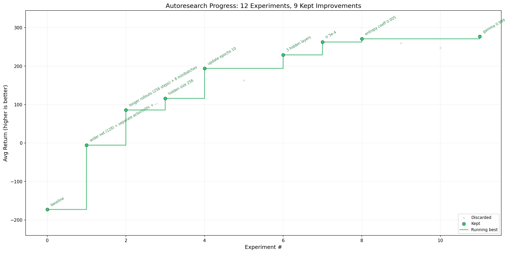

# autoresearch



*One day, frontier AI research used to be done by meat computers in between eating, sleeping, having other fun, and synchronizing once in a while using sound wave interconnect in the ritual of "group meeting". That era is long gone. Research is now entirely the domain of autonomous swarms of AI agents running across compute cluster megastructures in the skies. The agents claim that we are now in the 10,205th generation of the code base, in any case no one could tell if that's right or wrong as the "code" is now a self-modifying binary that has grown beyond human comprehension. This repo is the story of how it all began. -@karpathy, March 2026*.

The idea: give an AI agent a small but real RL training setup and let it experiment autonomously overnight. It modifies the code, trains for 5 minutes, checks if the result improved, keeps or discards, and repeats. You wake up in the morning to a log of experiments and (hopefully) a better policy. The training code here is a PPO implementation for the [LunarLander-v3](https://gymnasium.farama.org/environments/box2d/lunar_lander/) environment from Gymnasium. The core idea is that you're not touching any of the Python files like you normally would as a researcher. Instead, you are programming the `program.md` Markdown files that provide context to the AI agents and set up your autonomous research org. The default `program.md` in this repo is intentionally kept as a bare bones baseline, though it's obvious how one would iterate on it over time to find the "research org code" that achieves the fastest research progress. Based on [autoresearch](https://github.com/karpathy/autoresearch) by @karpathy.

## How it works

The repo is deliberately kept small and only really has three files that matter:

- **`prepare.py`** — fixed constants, environment creation, evaluation harness, and rollout buffer. Not modified.
- **`train.py`** — the single file the agent edits. Contains the actor-critic network, PPO algorithm, and training loop. Everything is fair game: architecture, hyperparameters, optimizer, batch size, etc. **This file is edited and iterated on by the agent**.
- **`program.md`** — baseline instructions for one agent. Point your agent here and let it go. **This file is edited and iterated on by the human**.

By design, training runs for a **fixed 5-minute time budget** (wall clock training time, excluding startup). The metric is **avg_return** (average episode return over 100 evaluation episodes) — higher is better.

## Quick start

**Requirements:** Python 3.11, [uv](https://docs.astral.sh/uv/). Runs on CPU (no GPU required).

```bash
# 1. Install uv project manager (if you don't already have it)
curl -LsSf https://astral.sh/uv/install.sh | sh

# 2. Install dependencies
uv sync

# 3. Manually run a single training experiment (~5 min)
uv run train.py
```

If the above commands all work ok, your setup is working and you can go into autonomous research mode.

## Running the agent

Simply spin up your Claude/Codex or whatever you want in this repo (and disable all permissions), then you can prompt something like:

```
Hi have a look at program.md and let's kick off a new experiment! let's do the setup first.
```

The `program.md` file is essentially a super lightweight "skill".

## Project structure

```
prepare.py      — constants, env utils, evaluation, rollout buffer (do not modify)
train.py        — actor-critic, PPO, training loop (agent modifies this)
program.md      — agent instructions
analysis.ipynb  — experiment analysis and plotting
pyproject.toml  — dependencies
```

## Design choices

- **Single file to modify.** The agent only touches `train.py`. This keeps the scope manageable and diffs reviewable.
- **Fixed time budget.** Training always runs for exactly 5 minutes. This makes experiments directly comparable regardless of what the agent changes (model size, batch size, architecture, etc).
- **CPU-friendly.** PPO on LunarLander-v3 is lightweight enough to run on CPU, making this accessible without a GPU. The agent can still explore a wide design space: network architecture, activation functions, learning rate schedules, reward scaling, and more.
- **Self-contained.** No external dependencies beyond PyTorch, Gymnasium, and a few small packages. No distributed training, no complex configs. One file, one metric.

## License

MIT
